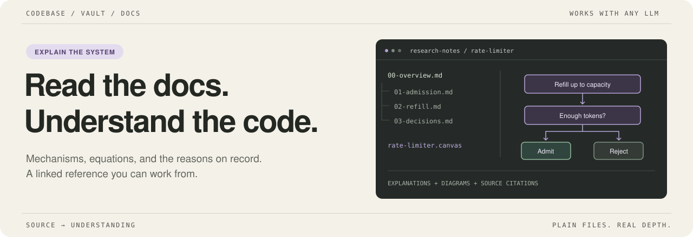
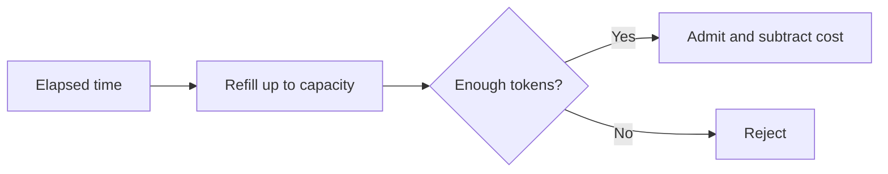

<p align="center">
  
</p>

<h1 align="center">Codebase Vault Docs</h1>

<p align="center">A Claude Code skill for turning a codebase into a technical reference you can actually work from.</p>

<p align="center">
  <a href="https://code.claude.com/docs/en/skills"></a>
  <a href="https://obsidian.md"></a>
  <a href="LICENSE"></a>
</p>

<p align="center">
  <a href="#quick-start">Quick start</a> ·
  <a href="#what-you-get">What you get</a> ·
  <a href="examples/token-bucket.md">Read an example</a> ·
  <a href="CONTRIBUTING.md">Contribute</a>
</p>

---

## The docs on the other half of your screen

You are working on a codebase. The docs are open beside it. A question comes up: how does this mechanism work, where does that value come from, why was this approach chosen?

The answer should be on the page.

This skill tells Claude Code to read the source and build a folder-per-module Obsidian vault: explanations, equations, diagrams, recorded decisions, and links between the pieces. Every note has to stand on its own. Citations let you check the explanation; they do not do the explaining.

> **The test:** copy a note into an email. Would the person on the other end understand the mechanism without opening the source?

## Quick start

You need Git and [Claude Code](https://code.claude.com/docs/en/skills). Open the generated folder in [Obsidian](https://obsidian.md) to use the wikilinks, Mermaid diagrams, and Canvas maps together.

### 1. Install the skill

Clone the repo, then copy its skill directory into Claude Code's personal skills folder:

```bash
git clone https://github.com/blur3hq/codebase-vault-docs.git
mkdir -p ~/.claude/skills
cp -R codebase-vault-docs/codebase-vault-docs ~/.claude/skills/
```

The installed entry point should be `~/.claude/skills/codebase-vault-docs/SKILL.md`. The outer folder is the repository; the inner folder is the skill.

<details>
<summary>Install for one project instead</summary>

From your target project's root, copy the skill from your local clone:

```bash
mkdir -p .claude/skills
cp -R /path/to/codebase-vault-docs/codebase-vault-docs .claude/skills/
```

Replace `/path/to/codebase-vault-docs` with the path to this repository. Commit `.claude/skills/codebase-vault-docs/` if you want to share the skill with your team.

</details>

### 2. Give it a concrete starting point

Start Claude Code in the codebase you want documented:

```text
/codebase-vault-docs Document the rate-limiter module in research-notes/.
Start with admission, refill, and the decisions recorded in its changelog.
```

Or ask naturally:

```text
Build an Obsidian reference vault for this codebase in research-notes/.
Start with the primitives, then work up through the modules that use them.
```

Claude can select the skill automatically when the request matches its description. Use `/codebase-vault-docs` when you want to invoke it directly.

### 3. Open the vault

Open `research-notes/` as a vault in Obsidian. Start at its index, follow a module's `00-overview.md`, and use the subsystem's Canvas to see how the pieces connect.

For a first run, pick one module you know well. Check its explanations against the source before expanding to the rest of the stack.

## What you get

An illustrative vault layout, with notes split along the module's actual seams:

```text
research-notes/
├── index.md                         # Start here
├── conventions/
│   └── style-guide.md               # Shared writing rules
└── rate-limiter/
    ├── 00-overview.md               # The module and its moving parts
    ├── 01-admission.md              # A request, from check to result
    ├── 02-refill.md                 # The equation and every term in it
    ├── 03-decisions.md              # Reasons that exist in the record
    └── rate-limiter.canvas          # How the pieces connect
```

The filenames after `00-overview.md` follow the subject. A solver, parser, and request router should not all be forced into the same outline.

| In the vault | What belongs there |
| --- | --- |
| **Mechanisms** | An explanation you can understand without opening the implementation. |
| **Diagrams** | A diagram in every note, with data handoffs drawn as edges. |
| **Equations** | Each term defined, its inputs traced, and the shape of the equation explained. |
| **Decisions** | The actual reason on record, backed by a comment, changelog, or incident. |
| **Discrepancies** | Docs/source mismatches stated explicitly, with correctness bugs made prominent. |
| **Connections** | Links to related notes and a Canvas map per documented subsystem. |

## The difference, on the page

A symbol table can tell you that a rate limiter has a token bucket:

```markdown
| Symbol | Kind | Source |
| --- | --- | --- |
| RateLimiter | class | RateLimiter.h:12 |
| TokenBucket | struct | RateLimiter.h:34 |
```

It cannot tell you how admission works. The explanation has to carry that:

> A bucket holds tokens up to a fixed capacity. Elapsed time replenishes them; an admitted request spends them. At each check, the limiter first adds the tokens earned since the previous check, caps the balance at capacity, and compares it with the request's cost. Enough tokens means admit and subtract. Too few means reject and keep the refilled balance.



The table is a lookup aid. The prose and diagram explain the mechanism. [Read the full illustrative note](examples/token-bucket.md), including the refill equation and a worked example. This is a teaching example, not output from a bundled source repository; real vault notes also need verified source citations.

## How the skill works

1. **Read the rulebook.** Load [`tone-and-structure.md`](codebase-vault-docs/references/tone-and-structure.md) and any existing vault conventions before writing.
2. **Gather facts.** Read the module's docs, public surface, and enough implementation to support the claims. Work bottom-up through interdependent modules.
3. **Explain the mechanisms.** Split the module into focused notes. Draw the handoffs, explain the math, and record decisions only when the reason is available.
4. **Clean up the prose.** Remove filler and AI-tell phrasing. The workflow pairs with [stop-slop](https://github.com/hardikpandya/stop-slop); its cleanup rules can also be applied directly.
5. **Connect the vault.** Cross-link related notes, update the Canvas, and add the module to the index.
6. **Verify the result.** Resolve links, check Canvas JSON and layout, and catch the Markdown quirks that break Obsidian rendering.

The skill is a set of instructions and a reference guide. Claude Code does the reading and writing with the tools available in your session. Source access, context limits, and review still matter.

## Built for the handoff

Use it when you are onboarding a teammate, taking over an unfamiliar system, or documenting a research codebase before extending it. It started with a multi-day documentation pass over a 14-module C++ physics and simulation stack, math and all.

The rules are language-independent; the original use case was C++. Notes are written in American English by default. Existing vault conventions can refine the style.

## Inside this repo

- [`SKILL.md`](codebase-vault-docs/SKILL.md): the entry point and per-module workflow.
- [`tone-and-structure.md`](codebase-vault-docs/references/tone-and-structure.md): the full writing, sourcing, Markdown, and Canvas rules.
- [`Example note`](examples/token-bucket.md): the level of explanation the rules ask for.
- [`Contributing`](CONTRIBUTING.md): how to propose a rule change with evidence.
- [`Changelog`](CHANGELOG.md): what changed.

## License

[MIT](LICENSE) · Copyright © 2026 Ian Rodriguez.
