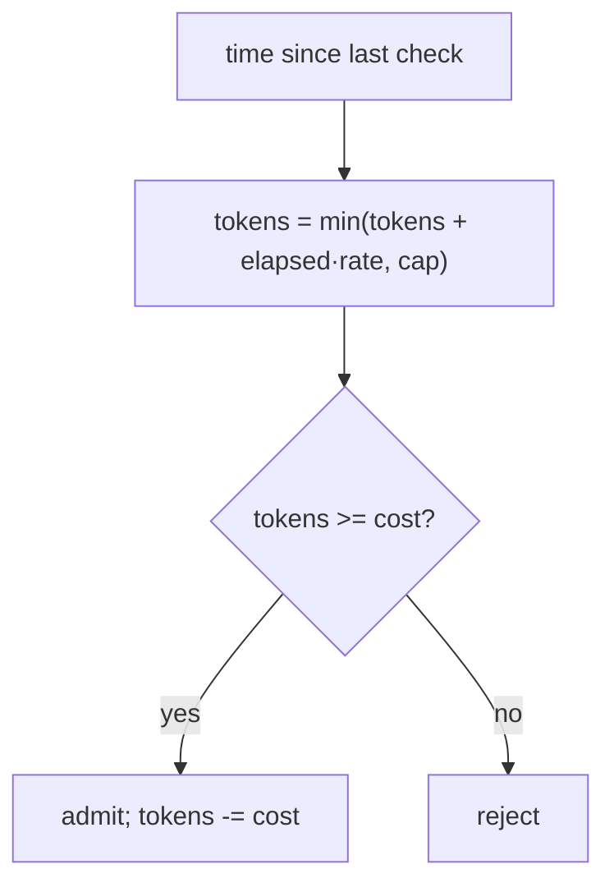

# codebase-vault-docs

A Claude Code skill that turns a codebase into a real technical reference: a folder-per-module Obsidian vault where every file explains a mechanism, not just indexes one.

## The test this skill is built around

Copy a file's content into an email. Would the person on the other end understand how the thing works without ever opening the source?

Most AI-generated documentation fails this test. It reads like this:

`````markdown
## Public surface

| Symbol | Kind | Source |
|---|---|---|
| `RateLimiter` | class | `RateLimiter.h:12` |
| `TokenBucket` | struct | `RateLimiter.h:34` |

**Decision:** uses a token bucket rather than a fixed window.
`````

That is an index. It tells you the rate limiter *has* a token bucket. It does not tell you what a token bucket is, how it refills, or why it was chosen over a fixed window. A reader who doesn't already know still has to open `RateLimiter.h`.

This skill produces the other thing:

`````markdown
## How admission works

A bucket holds tokens, refills continuously over time up to a cap, and
drains a fixed number of tokens per request. A request is only admitted if
the bucket currently holds enough tokens to pay for it.



Refill happens lazily, at check time, not on a background clock, so the
limiter needs no timer thread of its own (`RateLimiter.cpp:41-52`).

**Decision:** a fixed window (N requests per second, hard reset) was
rejected because it lets a full burst land in the last millisecond of one
window and another full burst in the first millisecond of the next,
briefly doubling the real rate. A token bucket smooths that out by
construction (`CHANGELOG.md:8`, the incident this replaced).
`````

Same fact. The second version is documentation. The first is a lookup table wearing documentation's clothes.

## What it produces

- One folder per module, never a single file: `00-overview.md` as the entry point, plus separate files split along the module's actual seams (an equation-heavy subsystem, a request lifecycle, a build-time decision history).
- A diagram in every file, however small the subject. If step 1 produces a value and step 2 consumes it, that handoff is a flowchart edge, not a sentence.
- Every non-obvious equation explained term by term, not just quoted with a line number.
- Every architecture decision labeled **Decision:** and backed by the real reason on record (a changelog entry, a code comment, a real incident), never an invented one.
- Real discrepancies between what a module's docs claim and what its build does, written down instead of papered over.
- An Obsidian Canvas mind map per documented subsystem, laid out so dependency edges stay short and legible instead of sweeping across the whole map.

## Install

```bash
git clone https://github.com/blur3hq/codebase-vault-docs.git ~/.claude/skills/codebase-vault-docs
```

Claude Code picks up any skill under `~/.claude/skills/`. Invoke it by asking to document a codebase, a module, or a specific mechanism, or let it trigger automatically on phrasing like "document this module," "explain how X works," or "map the architecture."

## How it works

1. Read `references/tone-and-structure.md` in full before writing anything. It is the rulebook, not a suggestion.
2. Gather facts first: the module's own README/changelog, its public headers, enough of the implementation to ground every claim in a real source line. For a small module, read all of it; for a large one, prioritize the public surface over every internal file.
3. Structure the module as a folder. Write the explanation, not the index, diagram every mechanism, explain every equation, cross-link to other modules instead of duplicating them.
4. Run a prose cleanup pass (pairs well with [stop-slop](https://github.com/hardikpandya/stop-slop): no em dashes, no filler adverbs, no AI-tell phrasing).
5. Update the module's mind map and the vault's index page.
6. Verify: every link resolves, no paragraph was hard-wrapped, no banned phrasing survived outside a direct quote.

The full rule set, including the markdown and Obsidian Canvas gotchas that silently break rendering if you don't know about them (hard-wrapped paragraphs rendering as broken lines, pipe-aliased links inside table cells, canvases that turn into unreadable tangles of crossing edges), lives in [`codebase-vault-docs/references/tone-and-structure.md`](codebase-vault-docs/references/tone-and-structure.md).

## Who this is for

Anyone who has to hand a codebase, a library, or a subsystem to someone else and would rather write the explanation once than answer the same question five times: engineers onboarding a teammate, analysts documenting a system they didn't build, researchers writing up a codebase they're about to extend. It was built and battle-tested documenting a real multi-tier C++ physics and simulation stack, math and all, then generalized once the pattern held.

## License

MIT, see [LICENSE](LICENSE).
