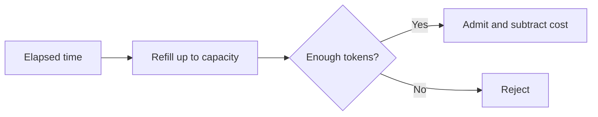

<p align="center">
  
</p>

<h1 align="center">Codebase Vault Docs</h1>

<p align="center">A prompt that turns a codebase into a technical reference: one Obsidian folder per module, where each file explains a mechanism instead of indexing it.</p>

<p align="center">
  <a href="https://agentskills.io"></a>
  <a href="https://obsidian.md"></a>
  <a href="LICENSE"></a>
</p>

<p align="center">
  <a href="#install">Install</a> ·
  <a href="#what-comes-out">What comes out</a> ·
  <a href="examples/token-bucket.md">Example note</a> ·
  <a href="CONTRIBUTING.md">Contribute</a>
</p>

---

The skill is a `SKILL.md` with the workflow, two reference files with the writing rules, and three small Python scripts that verify the output. They follow the [Agent Skills](https://agentskills.io) layout, so any agent that reads skill folders loads them as-is. Any other LLM works too: paste both files into the conversation and ask.

## The test

Copy a note into an email. Would the person on the other end understand how the thing works without opening the source?

Most generated docs fail this. They look like:

```markdown
| Symbol | Kind | Source |
| --- | --- | --- |
| RateLimiter | class | RateLimiter.h:12 |
| TokenBucket | struct | RateLimiter.h:34 |

**Decision:** uses a token bucket rather than a fixed window.
```

That tells you the rate limiter has a token bucket. It doesn't tell you what a token bucket is or how it refills, so you open `RateLimiter.h` anyway.

The skill asks for this instead:

> A bucket holds tokens up to a fixed capacity. Elapsed time replenishes them; an admitted request spends them. At each check, the limiter first adds the tokens earned since the previous check, caps the balance at capacity, and compares it with the request's cost. Enough tokens means admit and subtract. Too few means reject and keep the refilled balance.



Same fact. Now the note carries the explanation and the citation only lets you check it. [The full example note](examples/token-bucket.md) adds the refill equation and a worked check. It is illustrative, not output from a real repo, so it has no source citations; real notes need them.

## Install

The outer `codebase-vault-docs/` folder is the repository. The inner one is the skill. Copy the inner one into your agent's skills directory:

```bash
git clone https://github.com/blur3hq/codebase-vault-docs.git
cp -R codebase-vault-docs/codebase-vault-docs <your skills directory>/
```

You should end up with `<your skills directory>/codebase-vault-docs/SKILL.md`. The folder needs no changes per agent.

| Agent | User-wide | One project |
| --- | --- | --- |
| Claude Code | `~/.claude/skills/` | `.claude/skills/` |
| Codex | `~/.codex/skills/` | `.codex/skills/` |
| Cursor | `~/.cursor/skills/` | `.cursor/skills/` |

Other agents: check where yours looks for `SKILL.md` folders. If it has no skill support, paste `codebase-vault-docs/SKILL.md` and the two files under `references/` at the start of the conversation. The scripts are optional; run them yourself afterwards. The project-level copy can be committed so the team shares it.

## Use it

Start the agent inside the codebase and give it a concrete target:

```text
Document the rate-limiter module in research-notes/.
Start with admission, refill, and the decisions recorded in its changelog.
```

Agents with skill support load it on their own when the request matches the description in `SKILL.md` ("document this module", "explain how X works", "map the architecture"). Naming the skill in the prompt also works.

For the first run, pick a module you know well and check the notes against the source before pointing it at the rest of the stack.

Open the output folder as a vault in Obsidian. Wikilinks, Mermaid diagrams and Canvas maps render there.

## What comes out

```text
research-notes/
├── index.md                         # Start here
├── conventions/
│   └── style-guide.md               # Shared writing rules
└── rate-limiter/
    ├── 00-overview.md               # The module and its moving parts
    ├── 01-admission.md              # A request, from check to result
    ├── 02-refill.md                 # The equation and every term in it
    ├── 03-decisions.md              # Reasons that exist in the record
    └── rate-limiter.canvas          # How the pieces connect
```

The files after `00-overview.md` follow the module's own seams. A solver, a parser and a request router don't get the same outline.

What the rules require in every note:

- Prose that explains how the mechanism works and why it has that shape. Citations back the claim; they never replace it.
- At least one diagram, with each data handoff drawn as an edge.
- Equations explained term by term, with the inputs traced.
- Decisions labeled **Decision:** and backed by the reason on record (a changelog entry, a code comment, an incident). Never an invented one.
- Mismatches between a module's docs and its source written down, and correctness bugs stated up front rather than in a footnote.
- Links to related notes and an Obsidian Canvas per documented subsystem, laid out so the edges stay readable.

## How the skill works

1. Load [`tone-and-structure.md`](codebase-vault-docs/references/tone-and-structure.md) and any existing vault conventions.
2. Gather facts: the module's README and changelog, its public surface, and enough implementation to ground every claim in a source line. Bottom-up through interdependent modules.
3. Write the module as a folder. Explain each mechanism, diagram the handoffs, explain the math, and record decisions only when the reason exists.
4. Clean the prose with the checklist in [`prose-cleanup.md`](codebase-vault-docs/references/prose-cleanup.md): no filler, no comma splices, no AI-tell phrasing.
5. Cross-link related notes, update the Canvas, add the module to the index.
6. Verify with the scripts in [`scripts/`](codebase-vault-docs/scripts): every wikilink resolves, no paragraph is hard-wrapped, every Canvas parses and its edges stay between adjacent rows. Then re-check the citations in the touched files.

The skill is text. The agent does the reading and writing with whatever tools it has, so source access, context size and your own review still matter.

## Where it came from

A multi-day documentation pass over a multi-module C++ numerical codebase, math included, then generalized once the pattern held. The rules don't depend on the language. Notes come out in American English by default; an existing `conventions/style-guide.md` in the vault can override that.

## Inside this repo

- [`SKILL.md`](codebase-vault-docs/SKILL.md): the entry point and per-module workflow.
- [`tone-and-structure.md`](codebase-vault-docs/references/tone-and-structure.md): the writing, sourcing, Markdown and Canvas rules.
- [`prose-cleanup.md`](codebase-vault-docs/references/prose-cleanup.md): the cleanup checklist applied to every note.
- [`scripts/`](codebase-vault-docs/scripts): `check_wikilinks.py`, `unwrap.py`, `validate_canvas.py`. Python 3, no dependencies.
- [`examples/token-bucket.md`](examples/token-bucket.md): the level of explanation the rules ask for.
- [`CONTRIBUTING.md`](CONTRIBUTING.md): how to propose a rule change with evidence.
- [`CHANGELOG.md`](CHANGELOG.md).

## License

[MIT](LICENSE) · Copyright © 2026 Ian Rodriguez.
