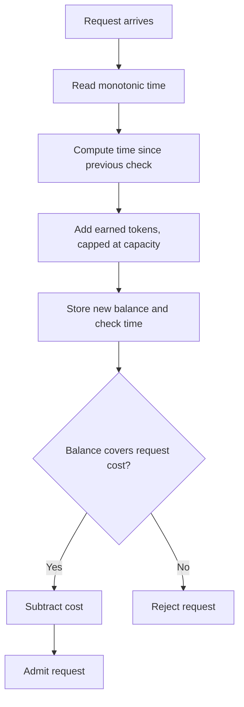

# How a token bucket admits a request

> **Illustrative example.** This note demonstrates the writing style. It describes a hypothetical limiter, not an implementation included in this repository. A real vault note must cite verified source lines for its equations and behavior, and record design decisions only when their reasons are available.

A token bucket controls admission by keeping a balance of tokens. The balance grows with elapsed time, stops growing at a fixed capacity, and decreases when a request is admitted. Each request has a token cost. If the refilled balance covers that cost, the limiter admits the request and subtracts the cost; otherwise it rejects the request and keeps the refilled balance.

## From check to result

This example uses lazy refill: tokens are calculated when a request checks the bucket. There is no background timer adding tokens between requests. The time between checks supplies the refill amount.

The check time is updated even when admission fails. Otherwise, a later check could count the same interval twice and award tokens it had already added. A monotonic clock measures elapsed time without following changes to the wall clock. The example assumes checks are serialized so that concurrent requests cannot spend the same tokens.

## The refill equation

Before checking admission, calculate the refilled balance:

$$
b_{\mathrm{refilled}} = \min(C,\; b + (t - t_{\mathrm{last}})r)
$$

| Term | Meaning | Unit |
| --- | --- | --- |
| $b$ | Balance saved after the previous check | tokens |
| $C$ | Maximum balance the bucket can hold | tokens |
| $t$ | Current monotonic time | seconds |
| $t_{\mathrm{last}}$ | Time recorded at the previous check | seconds |
| $r$ | Refill rate | tokens per second |

The elapsed interval, $t - t_{\mathrm{last}}$, multiplied by $r$ gives the number of earned tokens. Adding that to $b$ gives the uncapped balance. Taking the minimum with $C$ prevents a long idle period from accumulating an unlimited burst.

For a request with positive cost $k$, admission succeeds when $b_{\mathrm{refilled}} \ge k$. The saved balance then becomes $b_{\mathrm{refilled}} - k$. A rejected request spends no tokens. A request whose cost exceeds capacity cannot be admitted by this bucket, regardless of how long it waits.

## Walk through one check

Suppose capacity is 10 tokens, the saved balance is 2 tokens, and the refill rate is 4 tokens per second. A request costing 3 tokens arrives 0.5 seconds after the previous check.

The elapsed interval earns $0.5 \times 4 = 2$ tokens. The refilled balance is $\min(10, 2 + 2) = 4$. The request costs 3, so admission succeeds and leaves 1 token.

If another request costing 3 tokens arrives immediately, no time has elapsed to earn more. That request is rejected, and the balance remains 1 token.

## What a source-backed note would add

For a real implementation, cite the refill and admission code, describe its initial balance and numeric precision, and verify how it handles concurrent checks. If a changelog explains why the limiter uses a token bucket, quote that reason in a **Decision:** paragraph. Without that record, explain the observed behavior and leave the motivation unknown.

[Back to the README](../README.md#the-difference-on-the-page)
